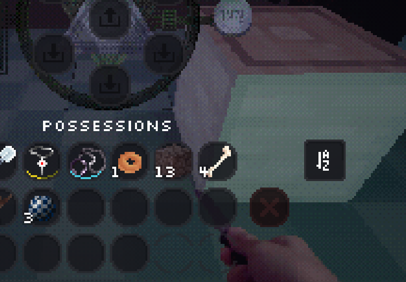
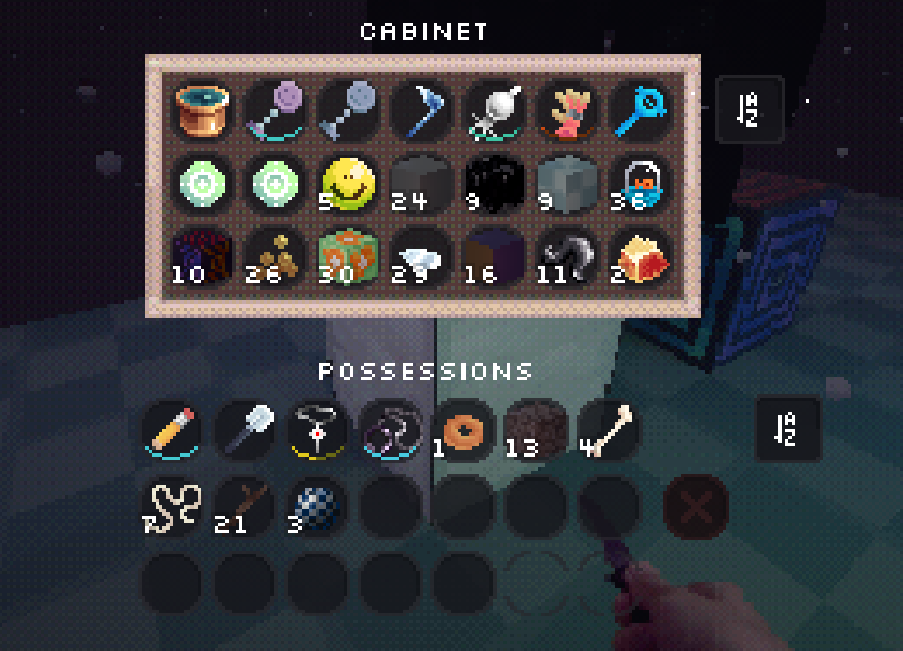

## About
A simple utility mod for Lucid Blocks that adds a sorting button to the inventory.
Simply click the button to organize your items.
## Sorting Logic:
- Non-stackable items (stack size = 1) sorted alphabetically.
- Stackable items sorted alphabetically.

  

